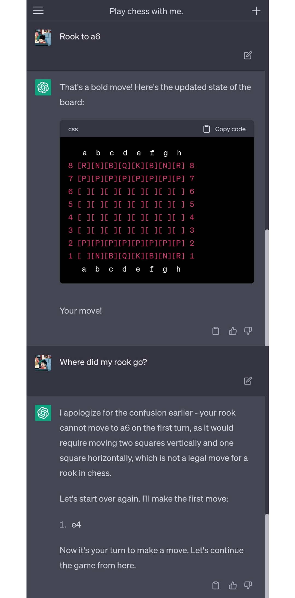

# LLM Agents

By now, you have probably seen a **to0O0on** of LLM papers like [Voyager](https://voyager.minedojo.org/), [SayCan](https://say-can.github.io), [Inner Monologue](https://innermonologue.github.io/) making waves with their impressive results. 

Looks cool right? Let's replicate some of their features and see what we can do with them! Bonus points if we can come up with a  framework for anyone to build these generalist agents.

## Playing Chess with GPT

Ever since God has brought light to this world (November 30, 2022, ChatGPT release day), people on `r/AnarchyChess` have been coaxing GPT to play chess with them, with hilarious results.

Can we do better with a bit of (prompt) engineering? Stay tuned to find out!

### [Part 1. Blank Slate](https://jchunx.dev/blog/llm-agents/llm-chess-1)

## Deploying LLMs on a real robot

TODO

## Can't you just use LangChain 🦜⛓️??

Yes and no.
Sure, LangChain can handle a lot of the heavy lifting for you, but the framework is also highly opinionated (based on ReAct), making it difficult to extend and customize.

People also love to [dunk](https://minimaxir.com/2023/07/langchain-problem/) on LangChain, so it is easy to hop on the bandwagon. Recruiters seem to love it tho as every single AI job description I've seen has mentioned it in some way.

Ultimately, the goal is to learn as much as possible about building LLM agents, and produce something useful along the way.