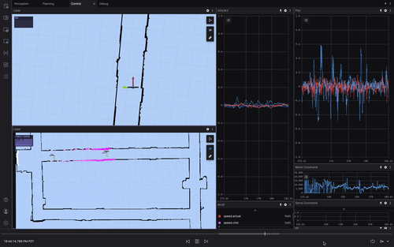
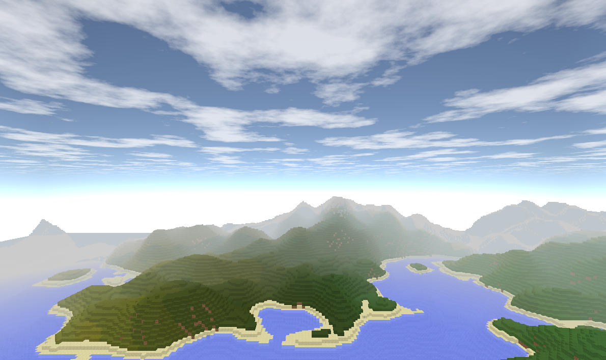
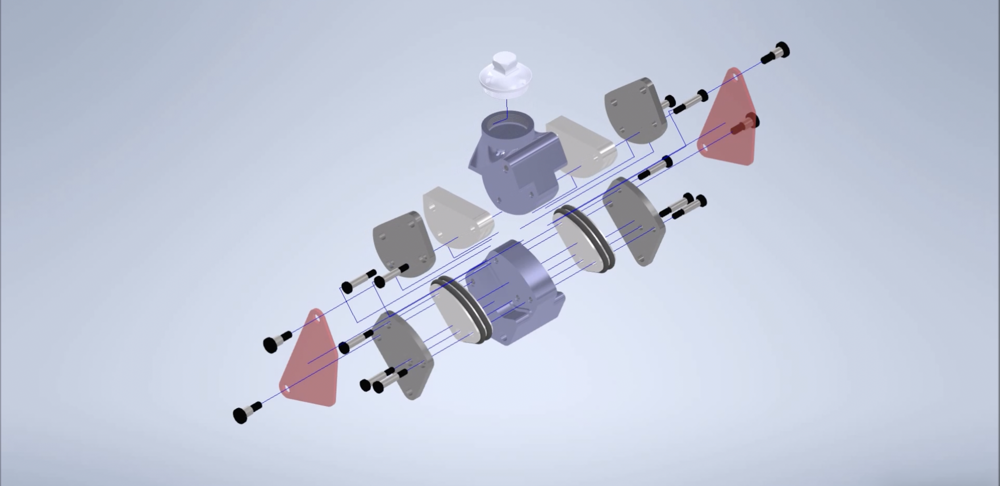

## **ABOUT**

**Hi, I'm Jason 🤠**

I am a 2nd year Robotics grad student at the University of Pennsylvania.

- I am currently... 
  - Leveraging large-language models to enable general embodied autonomy at Penn GRASP.
  - Developing 3D pre-trained vision encoders for robotics.
  - Working on WebGPU conditional diffusion models for image generation.
  - Training robots in large-scale simulations for outdoor tasks.
  
- In Summer 2023, I interned at Kodiak Robotics and worked on deep learning & vision models for autonomous trucking.
  
- Seeking full-time software engineering roles starting Summer 2024.

<!-- ## **🔥BLOGS🔥**

### [Series on LLM agents](blog/llm-agents)
 -->

## **PROJECTS**

### **CUDA Path Tracer** - Fall 2023

**Technologies:** C++, CUDA, OpenGL
**[🔗 Github](https://github.com/JChunX/CUDA-Path-Tracer)**

A path tracer written in CUDA.

In this project, I take advantage of the massively parallel processing power of GPU to render photorealisitc images. The end result is a interactive path tracer featuring specular and diffuse shading, along with several optimizations to improve performance.

### Scalable Robot Learning - Fall 2023, Ongoing

**Technologies:** PyTorch, ROS2, Isaac Sim, Generative AI, Reinforcement Learning

Currently, robotics paradigms maintain a ridgid stack of perception, planning, and control algorithms. While conceptually simple, it requires extensive tuning to achieve acceptable performance.

Departing from conventional wisdom, we envision robots of the future as end-to-end systems that achieves high performance through data-driven learning from massive amounts of synthetic data and real-world rollouts.

Towards that goal, we are creating a robust simulation and machine learning stack to tackle embodied autonomy tasks (parking lot striping) at scale.

**Features:**

- [x] **Asset-Level Domain Randomization**
Infinite variations of outdoor environments through wave-function collapse based procedural generation.

- [ ] **Controllable Diffusion**
Using simulation ground-truths, generate a dataset of scenes with varying environment conditions.
- [ ] **Akhara**
IsaacSim Gym environments for embodied agents.

### **Embodied AGI** - Fall 2023, Ongoing

**Technologies:** PyTorch, Multi-Modal LLMs, Mujoco

We are interested in applying multi-modal foundation models towards the goal of general embodied autonomy. Rather than evaluating benchmarks in sim, we seek to validate our models in the real world using a mobile manipulator.

**Progress:**

- [x] **Robotics Stack**
Motion planning, control, data logging, and visualization. Implemented communication protocols betwen robot and inference server in WebSockets.
- [ ] **Integration and Safety Checks**
Verify safety limits in sim (Mujoco), integrate components on real robot.
- [ ] **Foundation Models**
Implement baseline techniques and evaluate tasks on new methods. 

### **Vulcan Grass Shader** - Fall 2023

**Technologies:** C++, Vulkan, GLSL
**[🔗 Github](https://github.com/JChunX/Vulkan-Grass-Rendering)**

A grass simulation in Vulkan.

This project implements the paper *Responsive Real-Time Grass Rendering for General 3D Scenes*, including Bezier curve grass blades, physical models for grass motion, and culling.

### **F1Tenth Autonomous Racing** - Spring 2023

**Technologies:** Python, C++, ROS2, PyTorch, TensorRT, Drake

Goal: Don't crash and minimize laptime.

How: Implement a robust, safe, and fast autonomy stack on the NVIDIA Jetson edge computer.

What we did:

- Perception: Convolutional LiDAR outlier rejection, Hardware-accelerated Bresenham collision detection, Obstacle tracking, Neural object detection with TensorRT
- Planning: Custom frenet frame planner, Direct collocation + mininum curvature trajectory optimization, RRT*
- Control: Hardware-accelerated LQR, Adaptive cruise control, Disparity-extended gap-following, Time-to-collision based obstacle avoidance
- Operations: Custom telemetry bringup and recording, Visualization on Foxglove Studio

What we achieved:

- **1st place**, Penn ESE 615 F1Tenth Race 2&3
- **1st place**, 12th F1Tenth Autonomous Grand Prix @ CPS-IoT 2023

### **Contrastive Reward Functions for Embodied Agents** - Spring 2023

**Technologies:** Python, PyTorch, Ai2Thor, OpenAI CLIP

Leveraging the power of CLIP (Contrastive Language-Image Pre-training), we adapt CLIP embeddings to learn a dense reward function for embodied agents. Using a transformer-based architecture, the reward model learns to pair video frames and corresponding language instructions by minimizing the InfoNCE loss. We showcase the model's potential for fine-tuning sparse reward tasks by demonstrating its ability to return appropriate rewards in a variety of scenarios.

### **Neural-Inertial Odometry Sensor Fusion on the F1Tenth Platform** - Spring 2023

**Technologies:** PyTorch, TensorRT, Python

Improved the robustness of a normalizing-flow based lidar localization system (Local_INN) by fusing IMU accelerometer data with neural network odometry estimates using an Unscented Kalman Filter. Created a ROS2 package for the system as a drop-in replacement for the particle filter-based localization system used by the F1Tenth platform.

### **Quadruped MPC Gait Transitions** - Fall 2022

**Technologies:** Drake, Mujoco, Python, C++

We are interested in the problem of transitioning between two different gaits for a quadruped robot. Building upon an existing convex MPC method for gait planning, we extend it to handle gait transitions by planning over multiple potential next gait states.

### **Mini Minecraft** - Summer 2022

**Technologies:** C++, OpenGL

Adventures in 3D computer graphics and multi-threaded C++ programming. A simple Minecraft clone implementing custom shaders, voxel terrain generation, chunk management, and rendering.

### **Prosthetic Leg Software** - Spring 2022

**Technologies:** C++, Python, Tensorflow, ROS2, OpenCV, PyBullet

I led the software development at NCSU Pack Bionics, a student organization that designs and builds prosthetic legs for the Cybathlon Competition. Starting from scratch, I helped create the software stack for our prosthetic leg, including a Pybullet-ROS2 bridge for simulation, a vision-based gait planner, and an imitation learning based gait controller.

## **EDUCATION**

### **University of Pennsylvania** (2022-2024)

MSE, Robotics

### **University of North Carolina at Chapel Hill** (2018-2022)

BS, Computer Science & Biomedical Engineering
